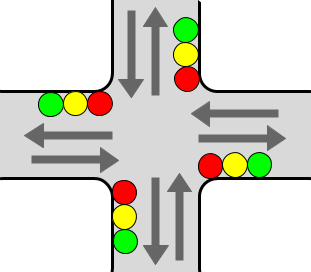
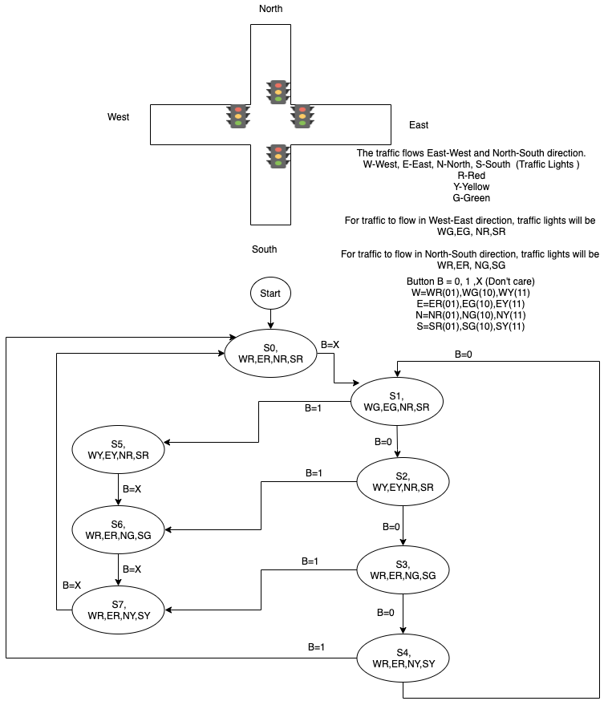

# traffic-lights
```
Consider a crossroad traffic light as shown below and assume that:

* Green goes to yellow and yellow goes to red
* Red goes directly to green (without an intermediate stage showing yellow)
* If a pedestrian has pushed the "request to cross" button, an all-red-for-cars stage will take 
place before the cycle restarts
```

```
1. Present a state diagram and a corresponding VHDL design file.
2. Use Vivado to prove the correctness of your solution by simulation.
```

# Solution
The state diagram


